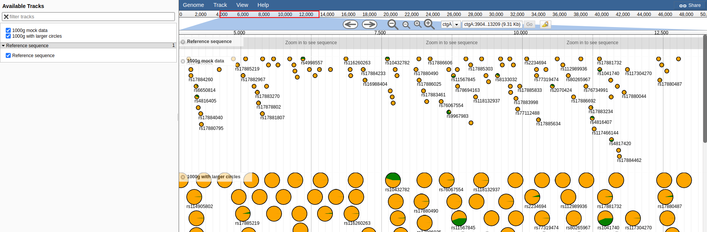

# piechart_plugin

A JBrowse plugin for plotting allele frequencies as a track glyph

## Screenshot

Showing 1000 genomes psuedo data variant and non-variant frequencies

## Example config

### Pie glyph (calculates from hom/het from genotypes)

This shows allele frequencies calculated from multi-sample VCF

    {
        "label": "Allele frequencies",
        "urlTemplate": "file.test.vcf.gz",
        "glyph": "PiechartPlugin/View/FeatureGlyph/Pie",
        "style": {
            "variantColor": "brown",
            "nonvariantColor": "purple"
        }
    }

In tracks.conf format

    [tracks.allele_freq]
    key=Allele frequencies
    urlTemplate=volvox.test.vcf.gz
    glyph=PiechartPlugin/View/FeatureGlyph/Pie

### PieAF glyph (calculates from the AF INFO tag)

This shows allele-frequency calculated from just using the AF tag in the info field

    [tracks.allele_freq]
    key=Allele frequencies
    urlTemplate=volvox.test.vcf.gz
    glyph=PiechartPlugin/View/FeatureGlyph/PieAF
    style.variantColor=grey,pink,brown

The style.variantColor is optional, a default set of grey,blue,red,green

## Configuration

- glyph - can be PiechartPlugin/View/FeatureGlyph/PieAF or PiechartPlugin/View/FeatureGlyph/Pie
- style.height - changes diameter of the drawn circle
- style.variantColor - with PieAF glyph, this is a comma separated list. With Pie glyph it is the color for any alt allele: default green
- style.nonvariantColor - the Pie glyph this is the color for the ref allele: default orange

## Test data

See test/data/ folder for example

Visit http://localhost/jbrowse/?data=plugins/PiechartPlugin/test/data to verify your installation

## Installation

Clone the repository to the jbrowse plugins subdirectory and name it PiechartPlugin

    git clone https://github.com/cmdcolin/jbrowse_piechart PiechartPlugin

Then add the plugin to your configuration, e.g. "plugins": ["PiechartPlugin"]

See http://gmod.org/wiki/JBrowse_FAQ#How_do_I_install_a_plugin for details
